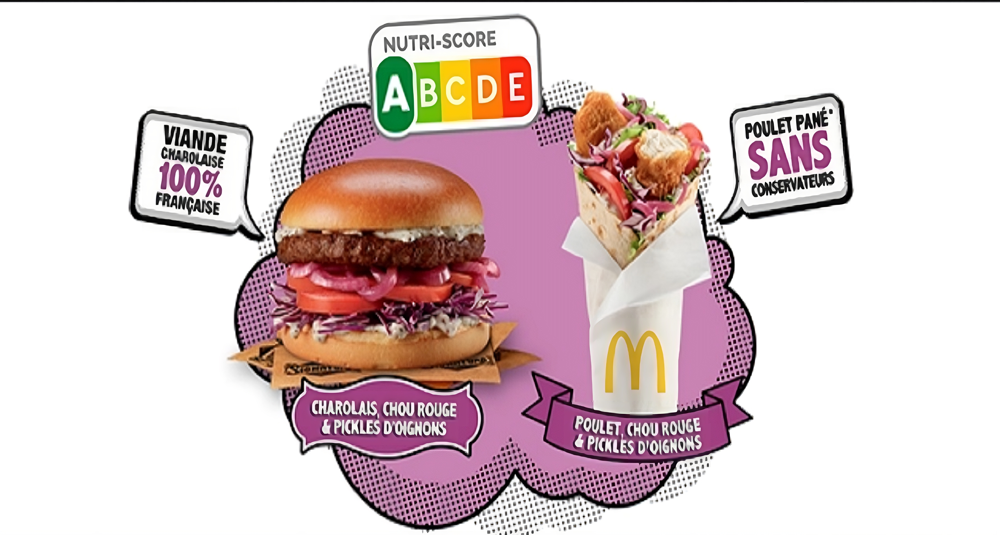

# Mcdo_-project_Prices_added

# MacDonald's nutrition score

## Introduction :
- Macdonad is a large fast food retaurent from usa, i guess you already know that 😉
- on this project we will analyse the nutrition score of each Macdonald menu (refer to it as mcdo)
- the csv file we are using is called : McDo_menu.csv
- link to kaggle datset : https://www.kaggle.com/datasets/mcdonalds/nutrition-facts
- the csv was sourced from Kaggle, however i have added a new column called "Prices" that was scraped from a bunch of websites that offres mcdo meals prices, so the data is similar to a real world scenario where you will have wrong values, wrong type and worng formatting
- refer to folder scrapping to find data from websites with respective links in the python script's files
- infos about the file : 
    - 24 columns excluding index
    - 363 rows
    - size 40,960 bytes
    - empty columns 0
    - empty rows 0
    - empty cells 2417 ( due to adding the price column)
    - all clos are float64/ int64 except first 4 cols : Category, Item, Prices, Serving Size
- lastely i m an undergrad so take it easy on me, you might find some errors, misinterpretion and wrong
  implementation, as i m still learning
